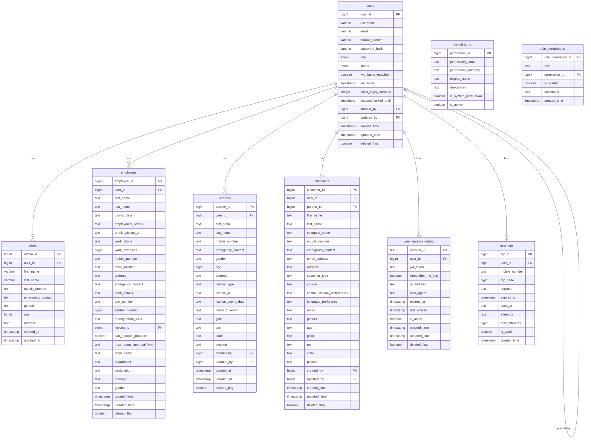
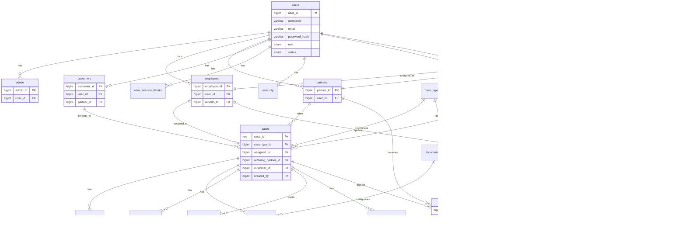

# Expert Claims Database - Entity Relationship Diagrams (ERD)

This document contains Entity Relationship Diagrams (ERD) for the Expert Claims backend database schema.

## Table of Contents
1. [Core User Management](#core-user-management)
2. [Case Management](#case-management)
3. [Backlog Management](#backlog-management)
4. [Leave Management](#leave-management)
5. [Bonus & Payment Management](#bonus--payment-management)
6. [Document Management](#document-management)
7. [Complete Database ERD](#complete-database-erd)

---

## Core User Management

### Users and Role-Based Tables



---

## Case Management

### Cases and Related Entities


---

## Backlog Management

### Backlog and Related Entities


---

## Leave Management

### Leave Applications and Types


---

## Bonus & Payment Management

### Bonus Structures and Calculations

```mermaid
erDiagram
    case_typ ||--o{ case_type_bonus_structures : "has"
    case_typ ||--o{ case_type_payment_phase_templates : "has"
    users ||--o{ case_type_bonus_structures : "creates"
    users ||--o{ case_type_bonus_structures : "updates"
    users ||--o{ case_type_payment_phase_templates : "creates"
    users ||--o{ case_type_payment_phase_templates : "updates"
    partners ||--o{ partner_bonus_calculations : "receives"
    cases ||--o{ partner_bonus_calculations : "triggers"
    case_type_bonus_structures ||--o{ partner_bonus_calculations : "uses"
    users ||--o{ partner_bonus_calculations : "calculates"
    users ||--o{ partner_bonus_calculations : "approves"
    
    case_type_bonus_structures {
        bigint bonus_structure_id PK
        bigint case_type_id FK
        double precision base_percentage
        jsonb stage_bonus_rules
        jsonb performance_multipliers
        bigint minimum_case_value
        bigint maximum_bonus_cap
        text calculation_trigger_stage
        boolean requires_payment_confirmation
        text effective_date
        text expiry_date
        boolean is_active
        bigint created_by FK
        bigint updated_by FK
        text created_time
        text updated_time
    }
    
    case_type_payment_phase_templates {
        bigint template_id PK
        bigint case_type_id FK
        text phase_name
        bigint phase_sequence
        bigint percentage_of_total
        boolean is_mandatory
        text description
        boolean is_active
        bigint created_by FK
        bigint updated_by FK
        text created_time
        text updated_time
    }
    
    partner_bonus_calculations {
        bigint calculation_id PK
        bigint partner_id FK
        varchar case_id FK
        bigint case_type_bonus_structure_id FK
        bigint case_value
        double precision base_bonus_amount
        text stage_bonus_amount
        bigint performance_multiplier
        text performance_adjustment
        double precision total_bonus_amount
        text calculation_date
        text calculation_trigger
        jsonb calculation_details
        boolean is_approved
        bigint approved_by FK
        text approved_date
        text approval_notes
        bigint calculated_by FK
        text created_time
    }
```

---

## Document Management

### Document Categories and Files


---

## Complete Database ERD

### Full Database Overview



---

## Key Relationships Summary

### Primary Relationships

1. **Users** → Central entity linking to:
   - Admin, Employees, Partners, Customers (role-based tables)
   - Sessions, OTP (authentication)
   - Cases, Comments, Documents (created/updated by)

2. **Cases** → Core business entity:
   - Linked to Case Types, Employees, Partners, Customers
   - Has Comments, Documents, Stakeholders, Payment Phases
   - Tracks Stage History

3. **Backlog** → Pre-case management:
   - Similar structure to Cases but for gap analysis
   - Has Comments and Documents
   - Linked to Partners and Employees

4. **Leave Management**:
   - Employees apply for leaves
   - Leave Types define leave categories
   - Users approve/reject applications

5. **Bonus System**:
   - Case Types have Bonus Structures
   - Partners receive bonuses based on Cases
   - Calculations tracked in Partner Bonus Calculations

6. **Document Management**:
   - Document Categories defined per Case Type
   - Documents attached to Cases and Backlogs
   - Users upload documents

---

## Notes

- **Soft Deletes**: Most tables use `deleted_flag` for soft deletion
- **Audit Fields**: Most tables have `created_by`, `updated_by`, `created_time`, `updated_time`
- **Self-Referencing**: 
  - `users` table references itself for `created_by` and `updated_by`
  - `employees` table references itself for `reports_to`
  - `case_comments` table references itself for `parent_comment_id`
- **Enum Types**: 
  - `users.role` uses `user_role_enum`
  - `users.status` uses `user_status_enum`

---

**Last Updated**: 2024-12-17
**Database**: PostgreSQL (Supabase)
**Schema**: public

